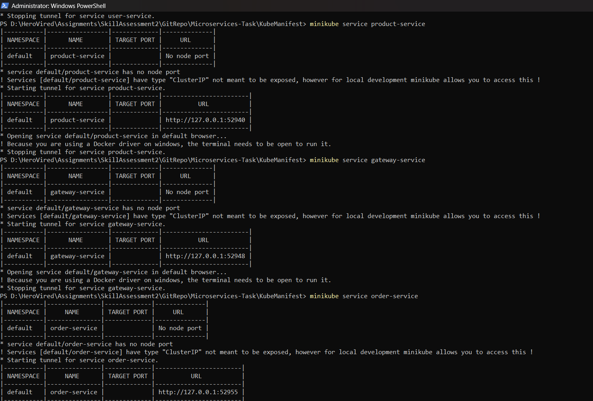

# Microservices Kubernetes Deployment Assessment

## Objective
Deploy a microservices application on Kubernetes using Minikube, implementing proper service communication and ingress configuration.

---


## Prerequisites
Microservices application code hosted in Github repository
-  Fork https://github.com/mohanDevOps-arch/Microservices-Task.git to https://github.com/SyamalaKadmi/Microservices-Task.git

- Make sure Docker & Docker Compose, kubectl, minikube in installed on your machine

## Instructions
---

### 1. DockerFiles creation
1. Fork the mentioned Github repository into your repository and clone to your local using 
   git clone [<repositoryurl>](https://github.com/SyamalaKadmi/Microservices-Task.git)
2. Create a dockerfile for each of the 4 Microservices
   - Navigate to folder where the git repository is cloned. Under Microservices-Task\Microservices path, 4 Microservices folders are present
   - Create a Dockerfile for each of the services
      - user-service exposed to run on Port 3000
         [user-service Docker file](user-service/DockerFile)
      - product-service exposed to run on Port 3001
         [product-service Docker file](product-service/DockerFile)
      - order-service exposed to run on Port 3002
         [order-service Docker file](order-service/DockerFile)
      - gateway-service exposed to run on Port 3003
         [gateway-service Docker file](gateway-service/DockerFile)
   - Each of the dockerfiles should have following steps
      - Use nodejs latest image from Dockerhub website
      - Setup working directory
      - install dependencies using package.json
      - Expose appropriate port depending on the Microservice
      - Start the node application using cmd command
    - Build, Tag & Push the docker images to the dockerhub
    
---

### 2. Docker Compose Configuration 
1. Create a docker-compose.yml to run all the applications simultaneously
   [docker compose](docker-compose.yml)
   - Define all the four services
   - Set appropriate port mappings
   - establish service dependencies
   - configure networking between services
2. Start the services using 
    ```bash
        docker-compose up
    ```
---

### 3. Minikube setup
1. For Windows, download the minkube executable for the official website and install it - https://minikube.sigs.k8s.io/docs/start/?arch=%2Fwindows%2Fx86-64%2Fstable%2F.exe+download
2. Start Minikube and enable the Ingress controller: Open PowerShell and input below commands
    ```bash
        minikube start
        minikube addons enable ingress
    ```

---

### 4. Kubernetes Manifests
1. Create a folder structure to store the yaml files for user, product, gateway and order-service and a ingress file. 
    - Deployments: With container image references, resource limits, environment variables, health check probes, labels, and selectors.
    - Services: For service discovery and correct port configurations.
    - Ingress: To route requests to the respective services.The folder structure should be like below
    ```
    KubeManifest/
        ├── deployments/
        │   ├── user-service.yaml [user-service.yaml](KubeManifest/deployments/user-service.yaml)
        │   ├── product-service.yaml [product-service.yaml](KubeManifest/deployments/product-service.yaml)
        │   ├── order-service.yaml [order-service.yaml](KubeManifest/deployments/order-service.yaml)
        │   └── gateway-service.yaml [gateway-service.yaml](KubeManifest/deployments/gateway-service.yaml)
        ├── services/
        │   ├── user-service.yaml [user-service.yaml](KubeManifest/services/user-service.yaml)
        │   ├── product-service.yaml [product-service.yaml](KubeManifest/services/product-service.yaml)
        │   ├── order-service.yaml [order-service.yaml](KubeManifest/services/order-service.yaml)
        │   └── gateway-service.yaml [gateway-service.yaml](KubeManifest/services/gateway-service.yaml)
        └── ingress/
            └── ingress.yaml [ingress.yaml](KubeManifest/ingress/ingress.yaml)
    ```
    - Edit the files with the container images of each service respectively
2. Apply the manifests using
    ```sh
        kubectl apply -f deployments/
        kubectl apply -f services/
        kubectl apply -f ingress/ingress.yaml
    ```
    
3. Validation
    1. Verify the kubernetes pods
    
    2. Verify kubenetes Services
    
    3. Verify Ingress
    
   4. Check whether individual services are accessible using
      ```
      kubectl service <service-name>
      ```
      
      

3. Accessing services
    1. Fetch the minikube ip using 
    ```
        minikube ip
    ```
    2. Add the address to the /etc/hosts file:
    ```
     <minikube-ip> microservices.local>
    ```
    3. Access the services using 
    ```
      minikube ssh
      curl http://user-service:3000
      curl http://product-service:3001
      curl http://order-service:3002
      curl http://gateway-service:3003
    ```
    

